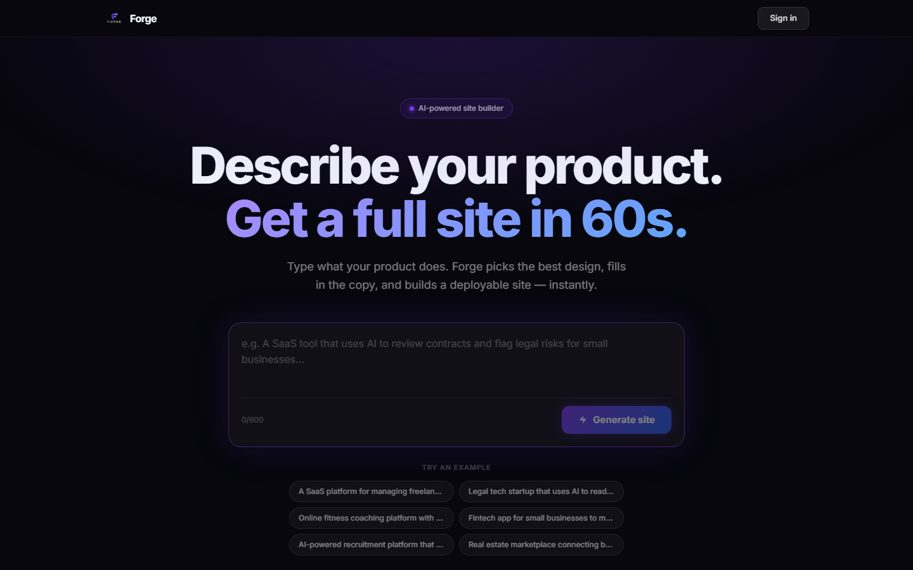
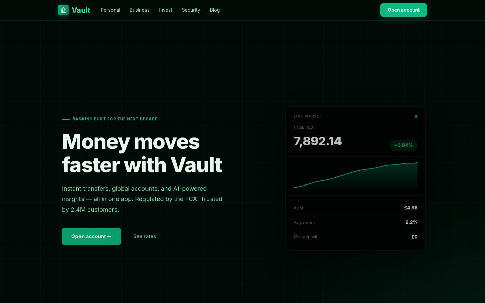
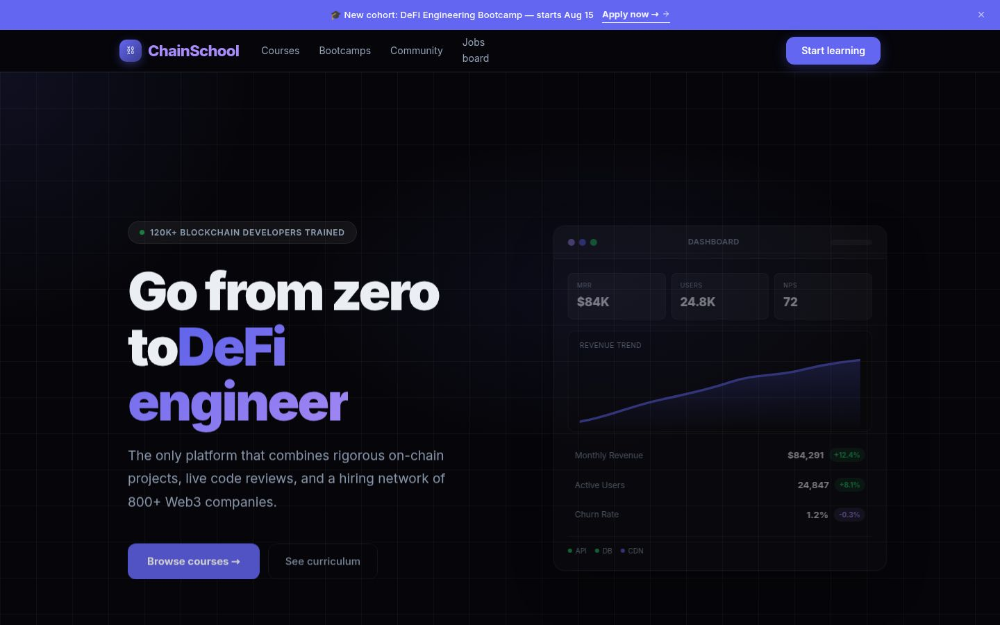
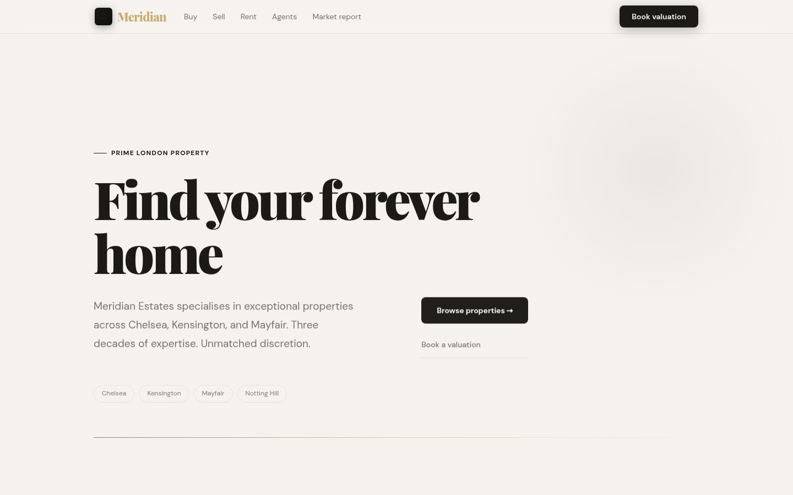
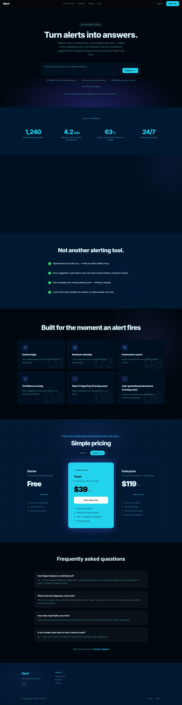
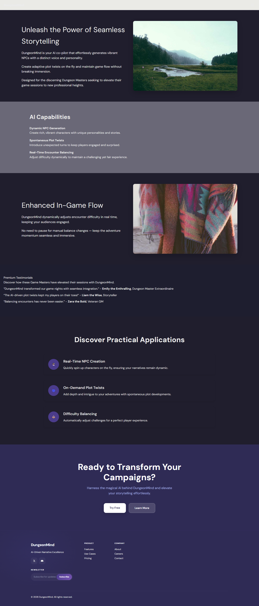
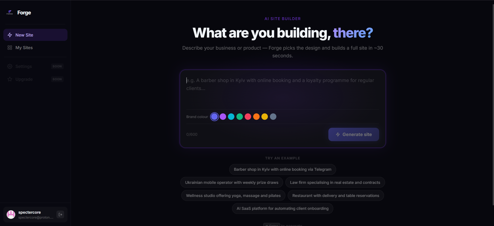

# Forge

**Describe your product. Get a full site in 60 seconds.**

## What it is

Forge turns a single sentence into a complete, deployable website. Type what your product does — a SaaS tool, a law firm, a fitness app, a crypto exchange — and Forge writes the copy, picks a design that actually fits the vertical, and hands back a real, production-quality site.

No template picker. No drag-and-drop editor. No blank canvas. You describe the product once; Forge does the rest.

## How it works, from the outside

1. **Describe your product** — plain English, one sentence is enough.
2. **AI selects the stack** — Forge reads the brand, the vertical, and the tone, and decides how the page should be structured for *this* product specifically, not a generic template.
3. **The build engine assembles the page** — every section gets real, on-brand copy and a consistent visual theme, not lorem ipsum and mismatched colors.
4. **Download and ship** — you get a real, working site. Yours to keep, customize, and deploy anywhere.

## See it in action

Every example below was generated from a single product description — nothing was hand-designed afterward.

### LexAI — legal tech

### Vault — fintech

### ChainSchool — Web3 education

### Meridian — real estate

### Signal — AI incident response (full page)

### Ground Truth — developer tools (full page)

### DungeonMind — gaming AI (full page)

Seven products, seven completely different tones, palettes, and layouts — legal, fintech, Web3, real estate, DevOps, dev tooling, gaming — from the same generator, with no manual design pass between prompt and result.

## Inside the workspace

## What makes it hold up

- **A planning step, not a template lookup.** Forge doesn't match your prompt to the closest pre-made layout. It plans a page structure specific to *your* product first, then fills each section in — which is why a legal tool and a game studio don't end up with the same skeleton wearing different colors.
- **Built and checked against real websites, not guesswork.** The component and layout library isn't just hand-designed — it's continuously benchmarked against real, live production sites, so Forge's sense of "what a good SaaS page looks like" is grounded in the actual web, not internal opinion.
- **Quality control before anything ships.** Every generated page is automatically screened for accessibility and completeness issues, and Forge self-heals — swapping in a better-fitting piece automatically — without a manual QA pass.
- **Every new component is stress-tested across themes before it's trusted.** A component can look fine in one color scheme and break in another; Forge validates new additions to the library across multiple themes before they're allowed to ship, so the failure mode doesn't reach a real generated site.
- **Real ownership, not a locked-in builder.** What you get back is an actual, standard web project — not a proprietary format, not hosted-only. You can open it, edit it, and deploy it anywhere.

## By the numbers

| | |
|---|---|
| Production components | 48 |
| Verticals supported out of the box | 8 |
| Average build time | ~30 seconds |
| What you own at the end | 100% of the source |

---

*This is a product showcase. Forge's implementation is not included in this repository.*
