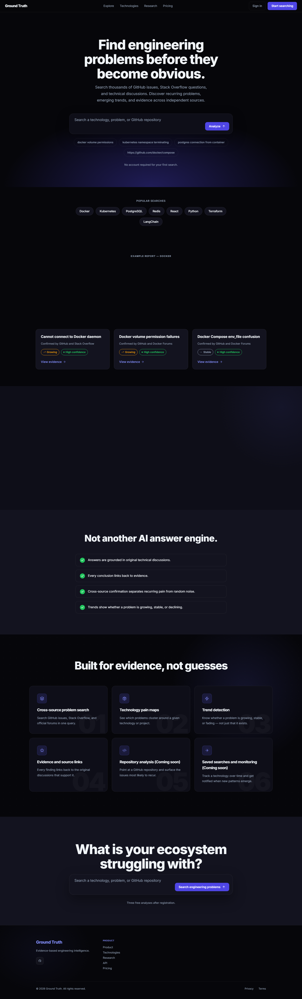
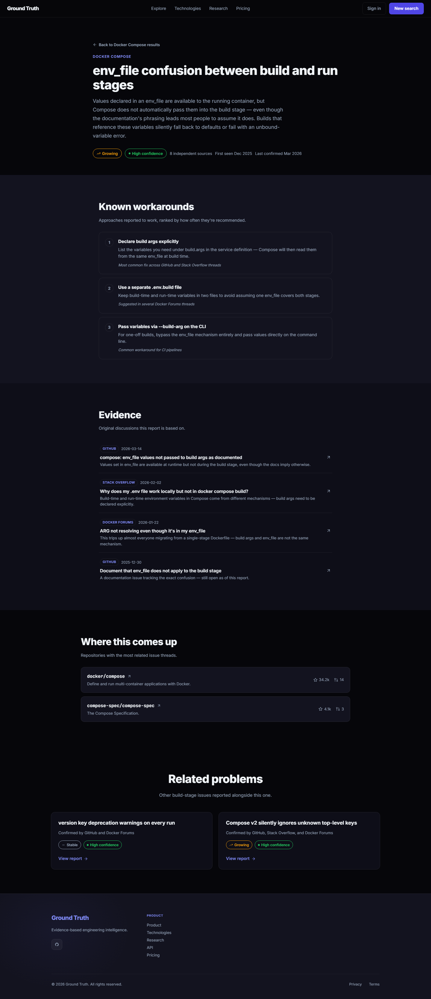
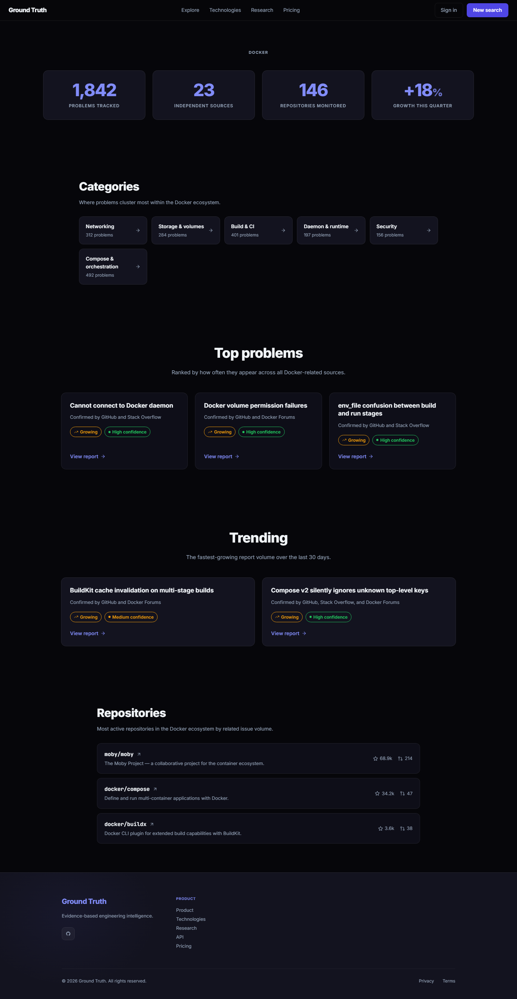
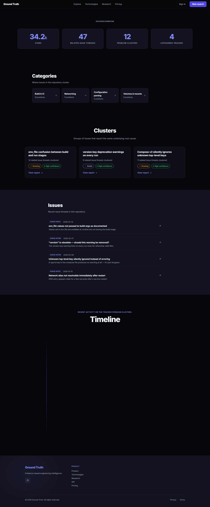
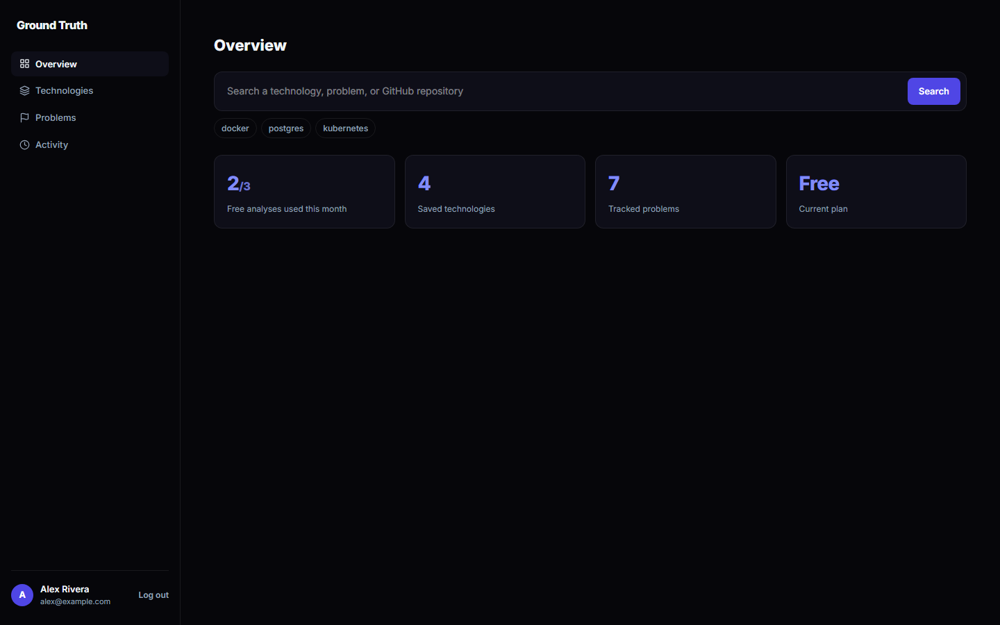

# Ground Truth

**Находи инженерные проблемы до того, как они станут очевидны.**

## Что это

Ground Truth ищет по тысячам GitHub issues, вопросов на Stack Overflow и технических обсуждений, чтобы честно ответить на один вопрос: это реальная, повторяющаяся проблема — или единичный случай? Ищешь технологию, конкретную проблему или GitHub-репозиторий — и получаешь повторяющиеся issue, растёт ли проблема или затухает, и, что важнее всего, реальные доказательства за каждым утверждением.

Это не очередной AI-чат, отвечающий по памяти. Каждый вывод прослеживается до реального, датированного обсуждения, которое можно открыть и прочитать самому.

## Не очередной AI-движок с ответами

- **Ответы опираются на реальные технические обсуждения** — а не на догадку модели о том, что звучит правдоподобно.
- **Каждый вывод ссылается на доказательство** — конкретный GitHub issue, тред на Stack Overflow или пост на форуме, откуда он взят.
- **Кросс-источниковое подтверждение отделяет реальную повторяющуюся боль от случайного шума** — одна громкая issue на GitHub — это точка данных; та же первопричина, независимо всплывшая на GitHub, Stack Overflow *и* форуме вендора — это уже паттерн.
- **Тренды показывают, растёт проблема, стабильна или затухает** — а не просто что она существует.

## Что ты получаешь

- **Отчёты по проблемам** — понятное описание проблемы, бейдж уверенности, тренд (растёт/стабильна/затухает), даты первого обнаружения и последнего подтверждения, репозитории, где встречается чаще всего.
- **Ранжированные обходные решения** — не просто список, а порядок по тому, насколько часто сообщество реально рекомендует каждое — то есть первым ты видишь то решение, к которому люди прибегают чаще всего.
- **Доказательства, а не ощущения** — каждый отчёт ссылается напрямую на исходные GitHub issues, ответы на Stack Overflow и треды на форумах, из которых он собран, каждое с датой и источником.
- **Обзор здоровья технологии целиком** — ищешь, например, Docker — и видишь общий health score, число проанализированных проблем, независимые источники, рост за квартал и то, какие категории (сеть, сборка и CI, безопасность…) страдают больше всего.

- **Разбор по конкретному репозиторию** — выбираешь репозиторий и видишь его кластеры проблем, категории и недавнюю активность issue по времени.

- **Личный воркспейс** — сохранённые технологии, отслеживаемые проблемы и история поиска в одном месте.

## Почему это реально работает

- **Он не отвечает по памяти — он отвечает доказательствами.** Если Ground Truth не может указать на реальное обсуждение за утверждением — он не делает это утверждение. Это не сноска мелким шрифтом, а вся суть продукта.
- **Подтверждение из нескольких источников — отдельный, более сильный сигнал.** Проблема, независимо зафиксированная на GitHub, Stack Overflow и форуме вендора — это не просто "три упоминания", это помечается иначе, чем единичная жалоба, потому что именно независимое подтверждение отличает реальный паттерн от шума.
- **У каждой проблемы есть тренд, а не просто счётчик.** Знать, что что-то случилось 40 раз, говорит меньше, чем знать, происходит ли это чаще в этом квартале, чем в прошлом — Ground Truth отслеживает и то, и другое.
- **Он честен насчёт того, чего пока не умеет.** Анализ первопричин на уровне репозитория и постоянный мониторинг явно помечены как "скоро" вместо того, чтобы выкатываться наполовину рабочими — вся ценность инструмента, построенного на доказательствах, рушится в тот момент, когда он начинает переобещать.

---

*Это продуктовая презентация. Реализация Ground Truth в этот репозиторий не включена.*
