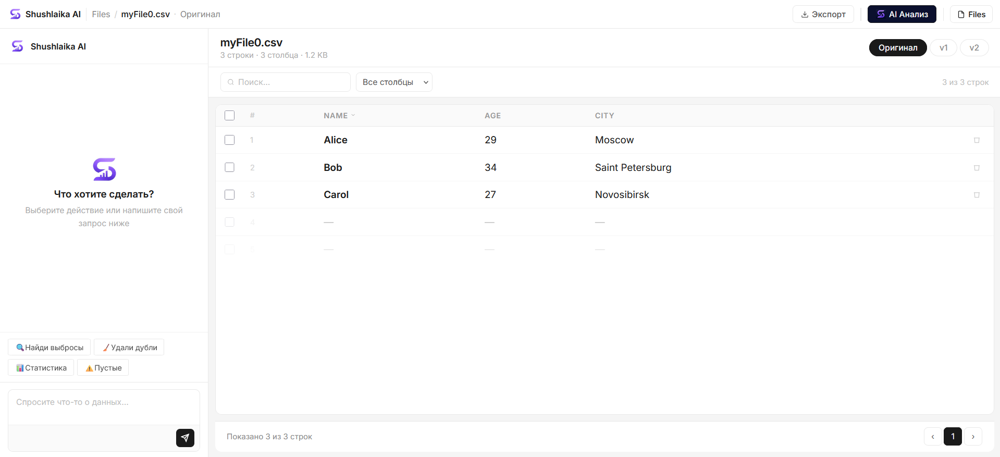

# Shushlaika AI

**Загрузи таблицу. Разговаривай с ней.**

## Что это

Shushlaika AI — воркспейс для данных, построенный вокруг одной идеи: не нужно писать формулы, открывать ноутбук или помнить синтаксис pandas, чтобы почистить или разобраться в таблице. Загружаешь CSV — и получаешь настоящую табличную вьюху с одной стороны и AI-ассистента с другой: задавай вопросы про свои данные или говори, что нужно поправить, обычным языком.

## Что с этим можно делать

- **Задавать вопросы про свои данные** — "сколько тут дублей", "что странного в этой колонке" — и получать ответ, основанный на том, что реально в файле, а не на общей догадке.
- **Чистить данные в один клик** — быстрые действия на самые частые случаи: найти выбросы, удалить дубли, найти пустые значения, получить сводную статистику.
- **Попросить что угодно более специфичное обычным языком** — если запрос не подходит ни под одно готовое действие, ассистент сам разбирается, какое преобразование нужно, а не разводит руками.
- **Никогда не терять оригинал** — каждое изменение становится новой версией (Оригинал → v1 → v2 → …) вместо перезаписи файла, так что всегда видно, что именно поменялось, и можно откатиться.
- **Видеть обновления в реальном времени** — воркспейс отражает новые файлы и изменения сразу, без ручного обновления страницы.
- **Экспортировать результат в любой момент** — забрать очищенные данные обратно как CSV.

## Почему это реально работает

- **Он сам выбирает способ, не ты.** Для запроса, который он уже умеет хорошо делать — дубли, выбросы, пустые значения, статистика — ответ приходит мгновенно через проверенную процедуру. Для чего-то более специфичного — он анализирует твои реальные данные и сам придумывает нужное преобразование. На простой вопрос — просто отвечает, без лишних правок в файле. Тебе не нужно знать, что из этого нужно именно сейчас — просто спрашиваешь.
- **Он читает твои данные, прежде чем отвечать.** Прежде чем что-либо трогать, ассистент строит реальный профиль файла перед собой — типы колонок, пропущенные значения, сколько уникальных значений в каждой колонке — поэтому его ответы и правки опираются на то, что реально лежит в твоих данных, а не на то, как обычно выглядит "типичный CSV".
- **Ничего не делается разрушительно.** Каждое действие — твоё или AI — фиксируется как новая версия с тем, что было запрошено и что изменилось, а не тихой перезаписью. Оригинал всегда на расстоянии одного клика.
- **Это настоящий воркспейс, а не одноразовый скрипт.** Файлы, версии и история привязаны к аккаунту и остаются там — это место, куда возвращаешься и продолжаешь работать, а не инструмент на один запуск, после которого результат теряется.

---

*Это продуктовая презентация. Реализация Shushlaika AI в этот репозиторий не включена.*
